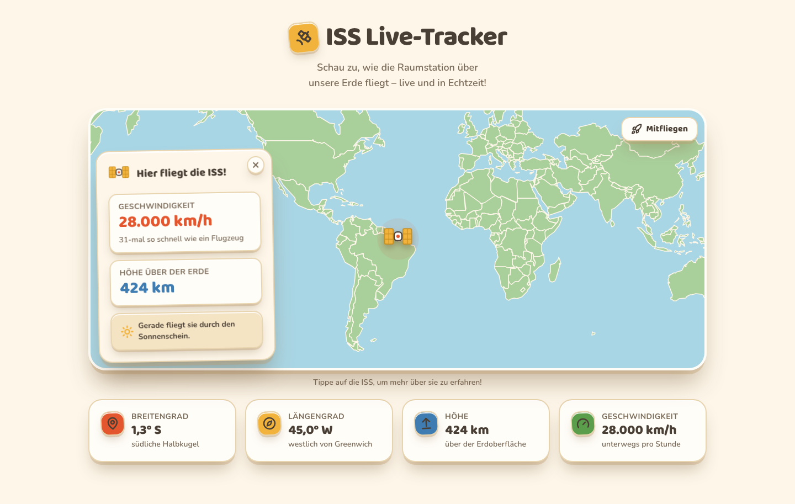
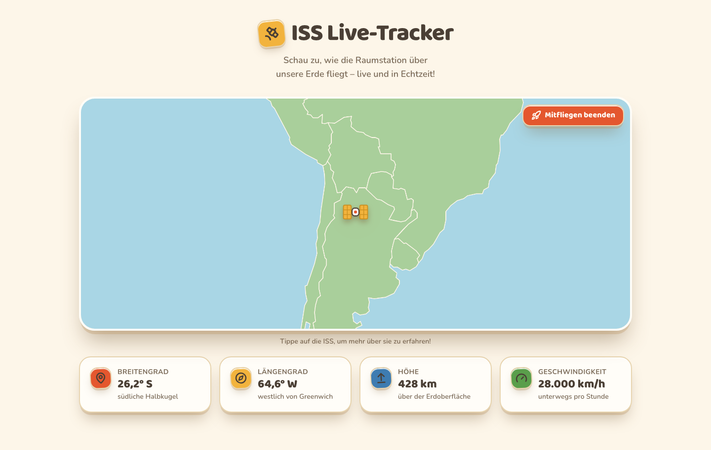

# ISS Live-Tracker 🚀

Eine Weltraumkarte für Kinder: Die Internationale Raumstation fliegt live über
eine selbstgebaute Papier-Erde. Kein dunkles Dashboard, keine Fachbegriffe –
sondern ein Diorama aus Bastelpapier, auf dem ein kleiner Satellit seine Runden
zieht.



---

## Was die App kann

| Nr. | Anforderung | Umsetzung |
| --- | --- | --- |
| **F1** | Weltkarte mit Erdteilen und ISS-Position | Leaflet-Karte mit 176 Länderumrissen im Papierlook |
| **F2** | Aktuelle Werte verständlich anzeigen | Breitengrad, Längengrad, Höhe und Geschwindigkeit als große Karten |
| **F3** | Automatische Aktualisierung, sichtbare Bewegung | Alle 5 Sekunden neue Daten, dazu ein „Mitfliegen"-Modus |
| **F4** | Fehlerfreundlich statt leerer Seite | Ladezustand, Fehlermeldung in Kindersprache, „Nochmal versuchen" |

Dazu die drei Kernlogiken aus dem Konzept:

1. **Live-Aktualisierung** – die Position wird alle 5 Sekunden neu geholt.
2. **Infofenster** – ein Klick auf die ISS öffnet eine Papierkarte mit allen
   Werten, darunter der Vergleich „31-mal so schnell wie ein Flugzeug".
3. **Erststart** – beim Laden passt sich die Karte an das Band an, in dem die
   ISS überhaupt fliegen kann (etwa 52° Nord bis 52° Süd). So ist die Station
   immer im Bild.

### Mitfliegen

Auf der ganzen Weltkarte legt die ISS in zehn Sekunden nur rund zwei Pixel
zurück – die Bewegung ist dann schlicht nicht zu erkennen. Der Schalter
„Mitfliegen" zoomt deshalb heran und lässt die Karte mitwandern, sodass
stattdessen die Erdoberfläche vorbeizieht.



---

## Schnellstart

```bash
npm install
npm run dev
```

Dann <http://localhost:3000> öffnen.

| Befehl | Zweck |
| --- | --- |
| `npm run dev` | Entwicklungsserver |
| `npm run build` | Produktions-Build |
| `npm start` | Produktions-Build starten |
| `npm run typecheck` | TypeScript prüfen (ohne Ausgabe) |
| `npm run lint` | ESLint |
| `npm run build:geo` | Länderdaten neu erzeugen (siehe unten) |

---

## Technik

- **Next.js 14** (App Router) mit **TypeScript** im Strict-Modus
- **Tailwind CSS** – das gesamte Design steckt in `tailwind.config.ts`
- **Leaflet** + **react-leaflet** als Karten-Engine
- **framer-motion** für das Infofenster, **lucide-react** für Symbole
- **native `fetch`** + `useEffect` – keine State-Bibliothek nötig

---

## Warum es so gebaut ist

### Keine Kacheln, keine fremden Server

Die Karte lädt **keinen Tile-Server**. Statt Luftbild-Kacheln werden die
Ländergrenzen aus einer mitgelieferten Natural-Earth-Datei gezeichnet und in
Bastelpapier-Farben gefüllt. Das hat drei Vorteile: Es sieht nach Diorama aus
statt nach Google Maps, es gehen keine Daten an Dritte, und es können gar nicht
erst Mixed-Content-Probleme entstehen.

### Warum die Ländergrenzen selbst gebaut werden

`scripts/build-world-geo.mjs` erzeugt `src/data/world.geo.json` aus der
TopoJSON-Datei von `world-atlas`. Zwei Dinge passieren dabei:

- **Antarktis wird entfernt.** Am unteren Bildrand zog sich sonst ein
  durchgehender grauer Streifen über die ganze Karte.
- **Länder, die den 180. Längengrad überqueren, werden aufgeschnitten.**
  Russland und Fidschi reichen über die Datumsgrenze. Ohne das Aufschneiden
  verbindet Leaflet die beiden Enden und malt lange waagerechte Linien quer
  über den Ozean.

Die Datei liegt mit 159 KB im Repository, damit der Build nicht von
`world-atlas` abhängt.

### Warum die App bei Fehlern langsamer wird

Zwanzig Kinder hinter einer IP fragen im Fünf-Sekunden-Takt – dann antwortet
die API mit `429 Too Many Requests`. Stur weiterzufragen hält die Sperre am
Leben, statt sie abklingen zu lassen. Die App wartet deshalb so lange, wie der
Server per `Retry-After` bittet, sonst 30 Sekunden. Nach der ersten
erfolgreichen Antwort läuft sie wieder im normalen Takt.

### Warum die ISS nicht doppelt geladen wird

Leaflet greift beim Import auf `window` zu und verträgt kein Server-Rendering.
Die Karte wird deshalb mit `dynamic(..., { ssr: false })` erst im Browser
geladen. Der Aufbau des ISS-Symbols liegt getrennt in `issMarker.ts`, damit die
Komponente für das Infofenster frei von Leaflet bleibt und auf dem Server
gerendert werden kann.

---

## Projektstruktur

```
src/
├── app/                  Layout, Startseite, globale Styles
├── components/
│   ├── map/              Leaflet-Karte, ISS-Symbol, Marker-Aufbau
│   └── ui/               Papierkarten, Kopfzeile, Werte, Infofenster
├── data/world.geo.json   Länderumrisse (erzeugt, eingecheckt)
├── hooks/                useIssPosition – Abfrage im 5-Sekunden-Takt
├── lib/                  API-Zugriff, Formatierung, Hilfsfunktionen
└── types/                Datenmodelle
scripts/
└── build-world-geo.mjs   Erzeugt die Länderdaten
```

---

## Deployment

```bash
npx vercel --prod
```

Vercel erkennt Next.js von selbst, es braucht keine Konfigurationsdatei und
keine Umgebungsvariablen. Die Abfrage der ISS-Daten läuft im Browser der
Besucher, nicht auf dem Server.

---

## Datenquelle

[api.wheretheiss.at](https://api.wheretheiss.at/v1/satellites/25544) –
kostenlos, ohne Schlüssel, ohne Anmeldung.

Die API erlaubt etwa eine Abfrage pro Sekunde und IP. Für einen einzelnen
Besucher mit einer Abfrage alle fünf Sekunden reicht das bequem; mehrere
gleichzeitig geöffnete Tabs oder eine ganze Schulklasse hinter einer IP
erreichen das Limit. Für diesen Fall greift die Pause oben.

Die Antwort der API wird vor der Verwendung geprüft (`isIssApiResponse`) –
sind Felder nicht wie erwartet, zeigt die App die Fehlermeldung statt mit
undefinierten Werten weiterzurechnen.
